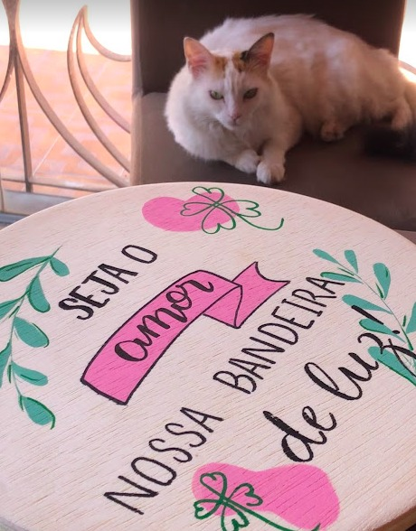
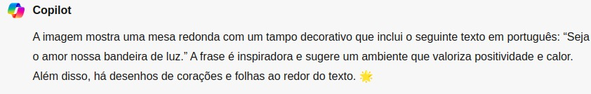
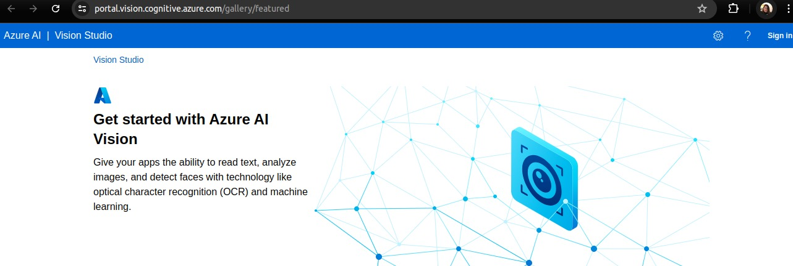

<h2 align="center">🤖Projeto explorando Copilot - Microsoft AI Bootcamp🤖 </h2>

<h4 align="justify">
Projeto proposto no Bootcamp <a href="https://www.dio.me/bootcamp/microsoft-copilot-ai?ref=CG&utm_medium=cpc&utm_source=google&utm_campaign=microsoft-copilot-ai&utm_term=pmax&utm_content=curso-ai&gad_source=1&gclid=CjwKCAjw5Ky1BhAgEiwA5jGujp5YqXR3DldXsU9Y9fgcvX31vAwNVwz6a3slqiZKtwnf3nADUgshQhoCqN8QAvD_BwE">Microsoft copilot AI</a> realizado pela <a href="https://www.alura.com.br/challenges/challenge-one-logica/sprint01-construa-decodificador-texto-com-javascript">Microsoft</a> em parceria com a <a href="https://www.dio.me/">Dio</a>, utilizando o copilot Microsoft Azure pra identificação de texto em imagens.
<h4/>

## O projeto:

1. Crie um novo repositório no github com um nome a sua preferência
2. Crie uma pasta chamada 'inputs' e salve as imagens que você utilizou
3. Crie uma pasta chamado 'output' e salve os resultados de reconhecimento de texto nessas imagens
4. Crie um arquivo chamado readme.md , deixe alguns prints descreva o processo, alguns insights e possibilidades que você aprendeu durante o conteúdo.
5. Compartilhe conosco o link do repositório

## Extraindo texto de imagens
#### Entrada 01

#### Saída 01

Saída em texto:
"A imagem mostra uma mesa redonda com um tampo decorativo que inclui o seguinte texto em português: “Seja o amor nossa bandeira de luz.” A frase é inspiradora e sugere um ambiente que valoriza positividade e calor. Além disso, há desenhos de corações e folhas ao redor do texto. 🌟"

Impressões: A pergunta no promto foi se ele conseguia verificar se havia algo escrito na imagem fornecida. A ferramenta não só conseguiu reconhecer como descreveu a imagem como um todo, para além de informar o texto e interpretá-lo dando o "tom" da frase e significado da frase. Finalizando com um emoji de sol deixando ainda mais "animado". 

#### Entrada 02

#### Saída 02

Saída em texto:
"Enviado por Copilot:
A segunda imagem exibe uma página da web com um cabeçalho que diz “Comece com o Azure AI Vision”. Abaixo do cabeçalho, há uma breve descrição que afirma: “Dê às suas aplicações a capacidade de ler, analisar imagens e detectar rostos com tecnologias como reconhecimento óptico de caracteres (OCR) e aprendizado de máquina.” Também há um ícone representando um olho dentro de um símbolo semelhante a um alvo, conectado a vários elementos de linhas e pontos que sugerem gráficos de rede ou conectividade. Essa imagem é relevante, pois mostra a interface do serviço Azure AI Vision, destacando recursos como OCR e capacidades de aprendizado de máquina para análise de imagens. Não há problemas matemáticos ou de lição de casa presentes nesta imagem. 🌟

Saiba mais: |  1 blup.in  |  2 abptech.com  |  3 any.run  |  4 nipoto.com  |  5 youtube.com  |  6 aka.ms  |"

Impressões: No segundo prompt deixei ainda mais "difícil", o correto seria pedir de forma mais clara o que eu esperava ao enviar uma segunda imagem, porém o prompt foi: "E nesta segunda imagem?"
Também achei uma ótima devolução, informou o que estava escrito no texto, o que havia na imagem, descrevendo a ilustração ao lado do texto e até mesmo interpretando-a. A única ressalva é que não informou em forma de texto o site que consta na url da imagem fornecida. O que para alguém que não tem visão, poderia dar a entender que não havia esta informação na imagem.

## Sobre Azure Open AI

O Azure OpenAI Service leva os incríveis modelos de IA da OpenAI para o Azure, permitindo que você crie soluções de IA potentes com toda a segurança, escalabilidade e serviços integrados da nuvem Azure.

Para usar os modelos de texto, código e as imagens do DALL-E, você vai precisar de uma assinatura aprovada do Azure.

Quer uma assinatura gratuita do Azure? Vá até https://azure.microsoft.com/free.
Precisa de acesso ao Azure OpenAI? Dá uma olhada em https://aka.ms/oaiapply

## Links importantes

- <a href="https://microsoftlearning.github.io/mslearn-ai-fundamentals/Instructions/Labs/12-generative-ai.html">Explore generative AI with Microsoft Copilot</a>
- <a href="https://microsoftlearning.github.io/mslearn-ai-fundamentals/Instructions/Labs/13-azure-openai.html">Explore Azure OpenAI</a>
- <a href="https://microsoftlearning.github.io/mslearn-ai-fundamentals/Instructions/Labs/14-azure-openai-content-filters.html">Explore content filters in Azure OpenAI</a>

